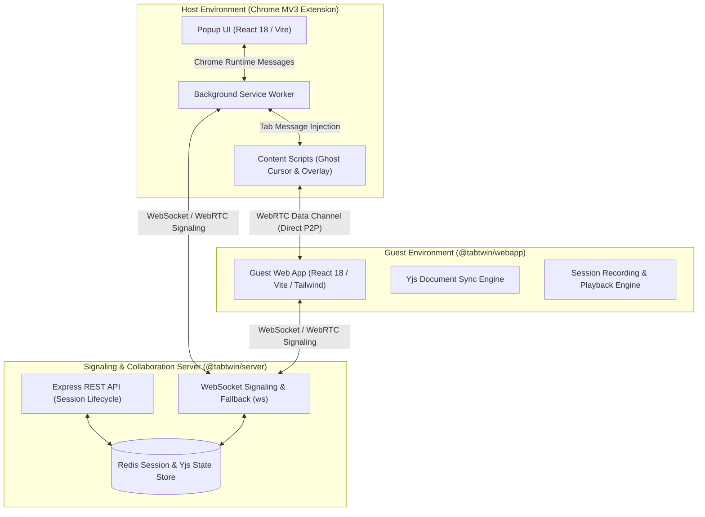
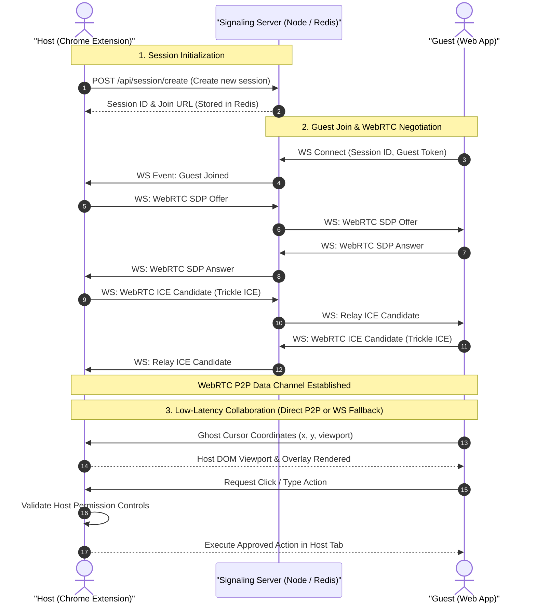
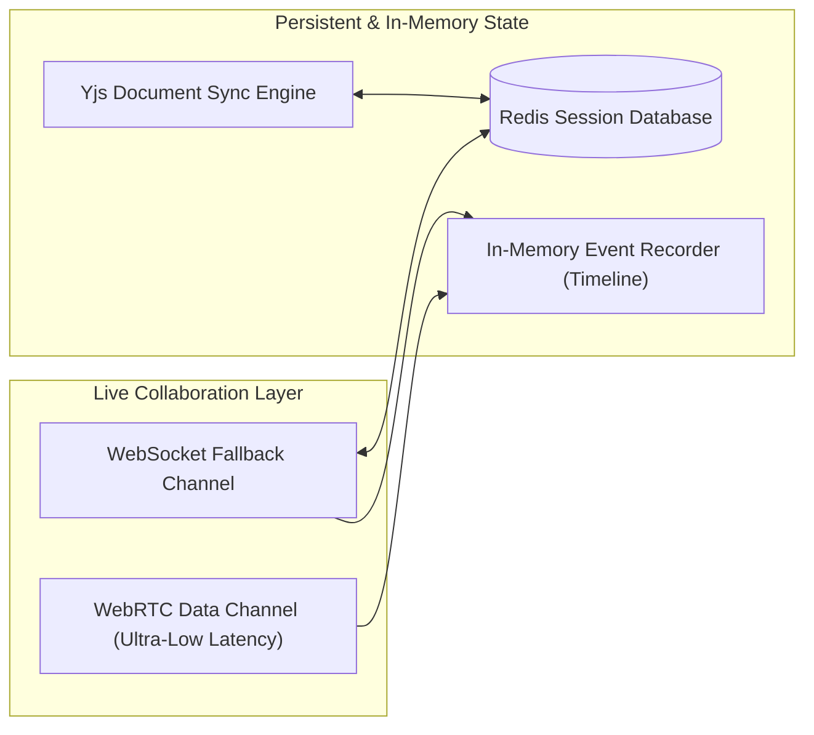

# TabTwin Architecture Documentation

This document provides a comprehensive technical overview of the **TabTwin** architecture, detailing system boundaries, runtime components, real-time collaboration data flows, security controls, and operational requirements. It is designed to help new contributors and maintainers understand how TabTwin enables secure, real-time browser tab collaboration with ghost cursors, annotations, and AI agent capabilities.

---

## 1. System Overview & Boundaries

TabTwin connects a **Host Chrome Extension** with one or more **Guest Web Applications** (or an AI agent) through a centralized **Signaling & Collaboration Server**. Unlike traditional video screen sharing, TabTwin operates directly within the browser DOM by injecting lightweight collaboration scripts into the host's active Chrome tab.

### Key Security & Boundary Design
- **Host Sovereignty:** The host remains in full control of their browser tab. Guests and AI agents cannot execute clicks, typing, or navigation without explicit permission or pre-approved rules.
- **Chrome Manifest V3 (MV3) Sandboxing:** Extension scripts execute within Chrome's isolated world, preventing direct access to or interference from target page scripts, while DOM overlays use safe DOM construction and scoping to avoid stylesheet collisions.
- **Signaling vs. Direct P2P:** Where supported, low-latency collaboration data (ghost cursor coordinates, scroll events, annotations) streams over direct **WebRTC Data Channels**, bypassing the server. When direct P2P is unavailable, traffic gracefully falls back to the **WebSocket Signaling Server**.

---

## 2. Runtime Components

TabTwin is organized as a monorepo containing three core workspaces:

| Component | Workspace Path | Tech Stack | Responsibility |
| :--- | :--- | :--- | :--- |
| **Signaling Server** | `server/` | Node.js 20+, Express, `ws`, ioredis | Handles REST session initialization, WebSocket WebRTC signaling, session state persistence in Redis, and optional Claude AI agent action dispatching. |
| **Guest Web App** | `webapp/` | React 18, Vite, Tailwind CSS, Yjs | Browser-accessible collaboration interface where guests join by link, transmit ghost cursor updates, draw annotations, and request click/type actions. |
| **Chrome Extension** | `extension/` | Chrome MV3, React 18, Vite, Tailwind | Host-side extension popup and content scripts that inject collaboration overlays into the target tab and enforce security permissions. |

### 2.1 Signaling & Collaboration Server (`server/`)
- **Session Manager (`sessionManager.js`):** Coordinates session creation, token validation, and participant tracking. Uses **ioredis** for scalable persistence across server restarts.
- **Signaling Handler (`signalingHandler.js`):** Routes SDP offers/answers, ICE candidates, and real-time cursor/action messages over WebSockets.
- **AI Agent Integration:** Integrates with the Anthropic Claude API (`ANTHROPIC_API_KEY`) to interpret DOM state and suggest or perform browser actions when host-approved.

### 2.2 Host Chrome Extension (`extension/`)
- **Popup UI:** Displays active session links, connected participants, and session termination controls.
- **Content Scripts:** Renders the interactive collaboration overlay inside the host's web page, displaying guest cursors, highlight marks, and drawing annotations without interfering with underlying page scripts.
- **Service Worker:** Maintains the persistent WebSocket/WebRTC connection to the backend server across tab navigation events.

### 2.3 Guest Web Application (`webapp/`)
- **Session Joiner:** Authenticates guests via session tokens without requiring any local browser extensions or software installations.
- **Collaboration Canvas:** Captures mouse movements, clicks, and keyboard intents, forwarding them as structured messages to the host tab.
- **Session Recorder & Timeline:** Captures a lightweight, in-memory sequence of collaboration events (cursor moves, clicks, annotations, approval requests) for instant timeline review and playback.

---

## 3. Real-Time Collaboration & WebRTC Data Flow

The sequence diagram below illustrates the end-to-end lifecycle of a collaboration session from establishment to live interaction:

---

## 4. Session Persistence & Recording Architecture

TabTwin separates persistent session metadata from ephemeral collaboration streams:

1. **Redis Persistence:** Session metadata (IDs, host tokens, participant rosters, approval settings) is persisted in Redis (`REDIS_URL`). This enables cross-instance session state sharing and horizontal scaling (note: Redis high availability requires replication, Sentinel, Cluster, or an equivalent managed configuration).
2. **Yjs State Synchronization:** Distributed state (such as collaborative drawing annotations and shared highlight marks) is synchronized using **Yjs** conflict-free replicated data types (CRDTs).
3. **Session Recording Engine:** The guest web application contains an optional event recorder that captures an ordered timeline of events (session lifecycle, cursor movements, annotations, and approved actions). This recording is held in memory for immediate playback in the UI.

---

## 5. Security & Operational Requirements

### 5.1 Security Requirements
- **Host Permission Gating:** All sensitive browser actions (clicks, form submissions, navigation, keystrokes) require explicit host approval unless the host has enabled automatic trusted-guest mode.
- **Token-Based Authorization:** Every session generates cryptographically secure, unique join tokens for both host and guests.
- **CORS & Origin Validation:** The backend server allowlists browser-supplied `Origin` headers against the trusted `CLIENT_URL` configuration and responds with appropriate HTTP CORS headers for cross-origin requests.

### 5.2 Operational Prerequisites
- **Node.js:** v20.0.0 or higher is required across all workspaces.
- **Redis Server:** A running Redis 6+ instance accessible via `REDIS_URL` is required (e.g., `redis://localhost:6379`).
- **Environment Configuration:**
  - `PORT`: HTTP and WebSocket server port (default: `3001`).
  - `CLIENT_URL`: Trusted web app URL for CORS and invite link generation (default: `http://localhost:5173`).
  - `ANTHROPIC_API_KEY`: Optional; required only when enabling AI agent capabilities.
